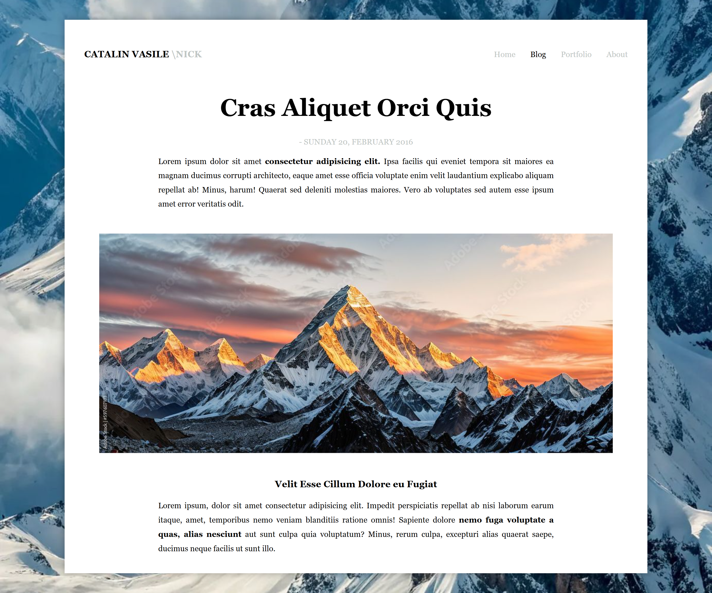

# 🧩 Challenge 1 — Blog Page Recreation (1 Day)

This project is part of my **1-Day UI Recreation Challenge**.  
The goal was to recreate a blog article layout from a reference design using only **HTML** and **CSS**.

Completed within one day to practice layout accuracy, structure, and styling fundamentals.

---

## 🎯 Challenge Goal

✔ Recreate the visual layout from a given design  
✔ Use semantic HTML structure  
✔ Apply CSS for layout, typography, and spacing  
✔ Maintain clean and readable code  

---

## ✨ Features

- Banner background image
- Centered content container
- Flexbox navigation header
- Blog title with date element
- Justified paragraph formatting
- Responsive full-width article image
- Clean serif typography
- Structured content sections

---

## 🛠️ Technologies Used

- HTML5
- CSS3 (Flexbox, Typography, Layout)

---

## 📂 Project Structure
challenge-1-blog-page
│
├── index.html
├── style.css
├── README.md
└── assets
├── bg.jpg
└── mountain.jpg

## 📸 Preview

## 📈 Skills Practiced

- Layout structuring
- Flexbox alignment
- Image control in CSS
- Text readability techniques
- Semantic HTML usage
- UI recreation from reference design

## 👩‍💻 Author

**Abinaya Thirumaran**  