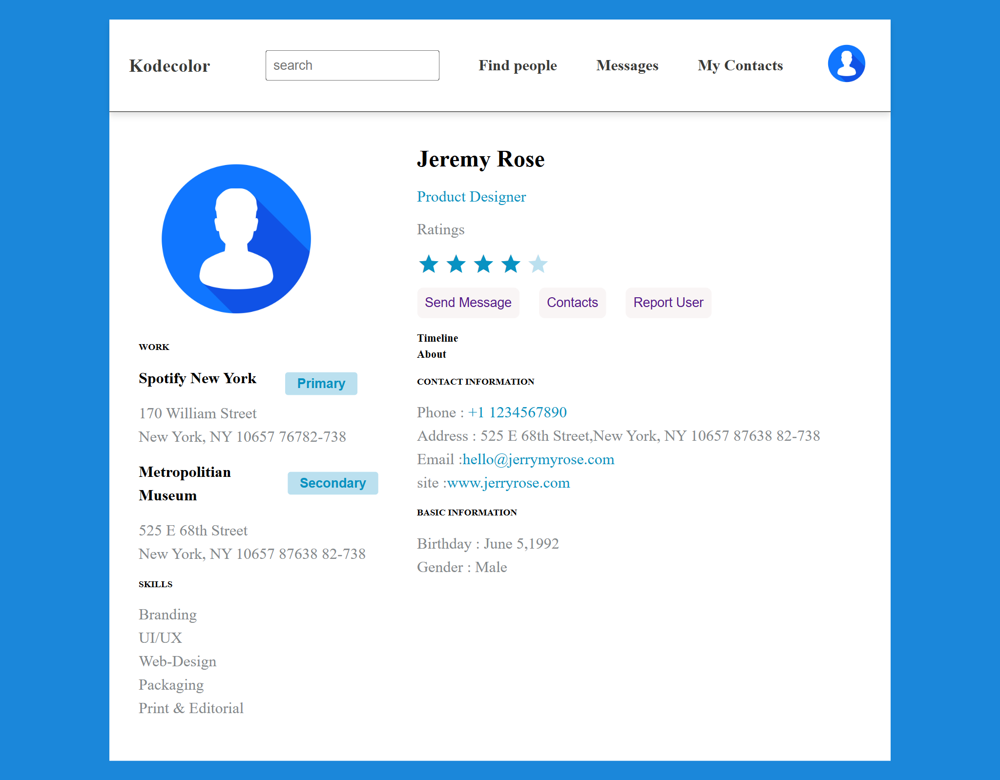

# CSS Social Media Page

## Challenge 2: CSS Social Media Page

This project is part of **Challenge 2** and demonstrates a **social media profile page layout** using **HTML and CSS**. The page includes a header with navigation, a profile section, a left panel for work and skills, and a right panel for contact and basic information.

---

## Features

- **header** with logo, search input, and navigation links.

- **Profile section** displaying user image, name, and role.

- **Left panel**:
  - Work experiences with **Primary** and **Secondary** buttons.
  - Skills section listing various design skills.

- **Right panel**:
  - Ratings with Material icons.
  - Action buttons (Send Message, Contacts, Report User).
  - Timeline, About, Contact Information, and Basic Information sections.

- **CSS Styling**:
  - Flexbox layout for header, main content, and button rows.
  - Custom **line spacing**, button styling, and color theme.
  - **Box shadow** for header to create a subtle elevation effect.

- Uses **Google Material Icons** for star ratings and other icons.

---

## File Structure
css-social-media-page/
│
├── index.html # Main HTML file
├── style.css # CSS styling
├── assets/
│ └── profile.jpg # Profile image used in the page
└── README.md # Project 

## Technologies Used

- HTML5
- CSS3
- Google Material Icons

## Screenshots

## Author

**Abinaya Thirumaran**  
